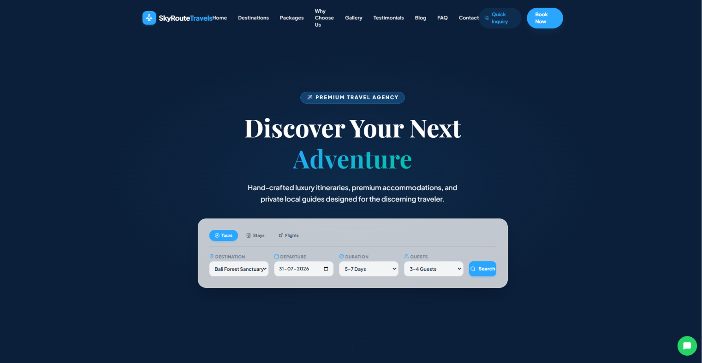
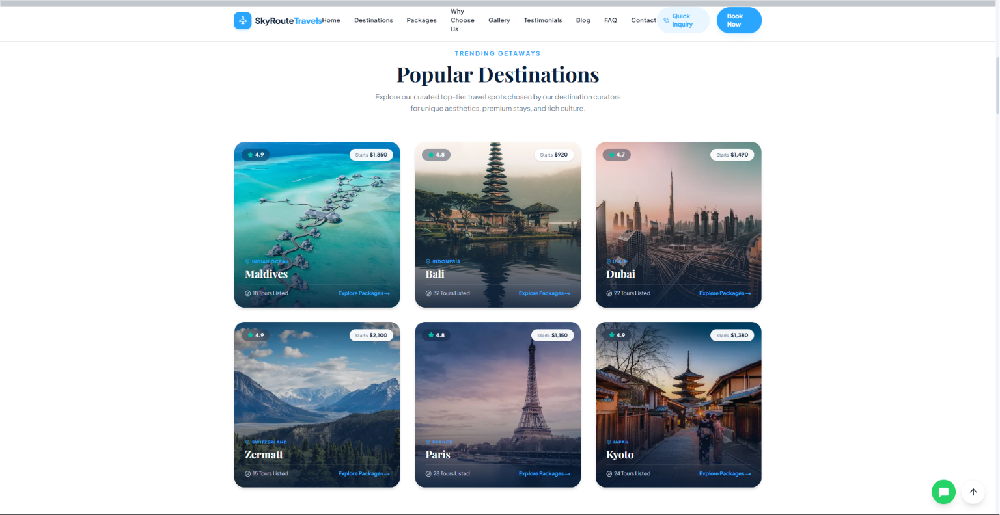
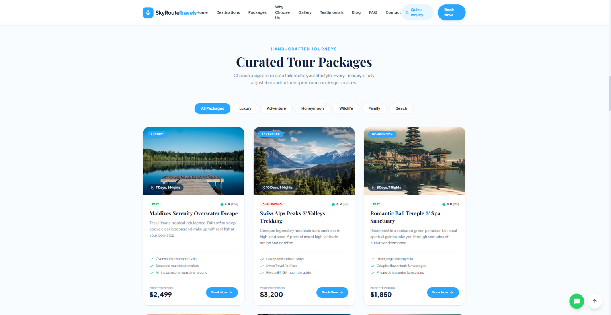
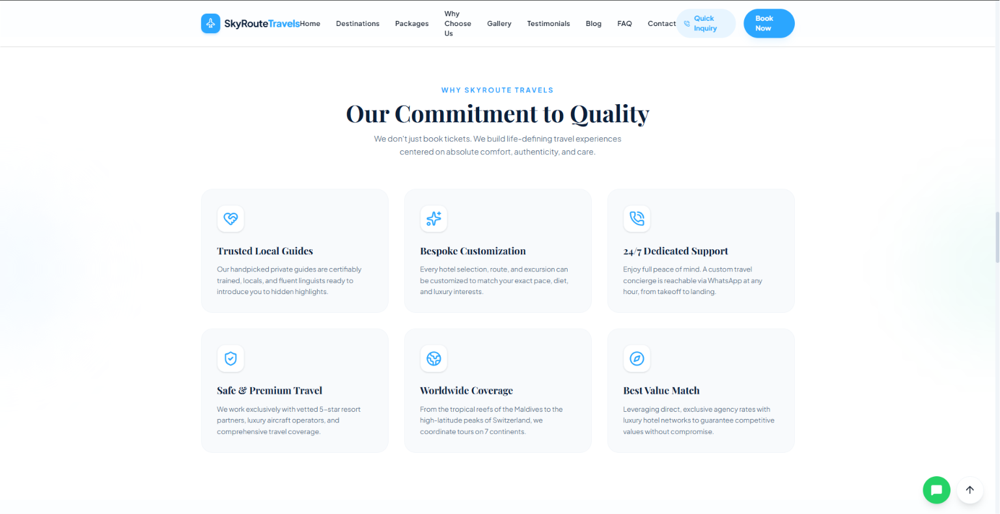
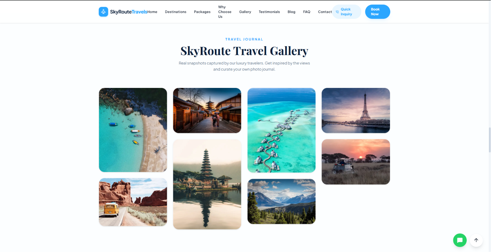
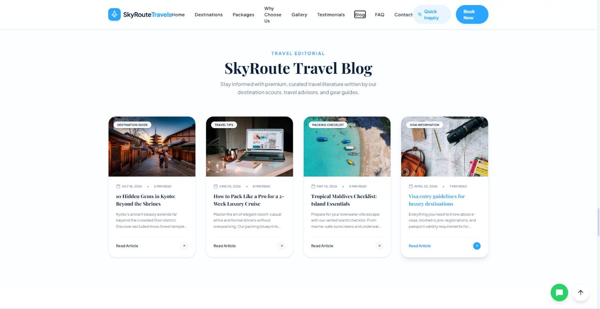
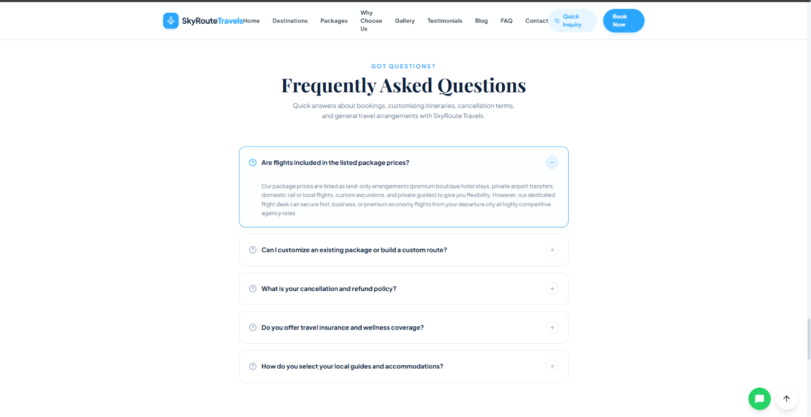
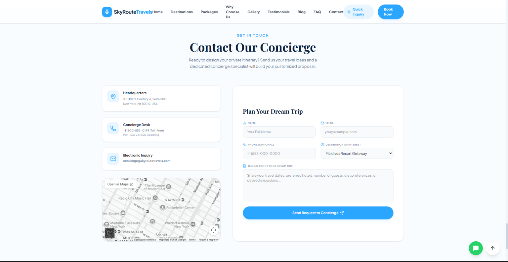
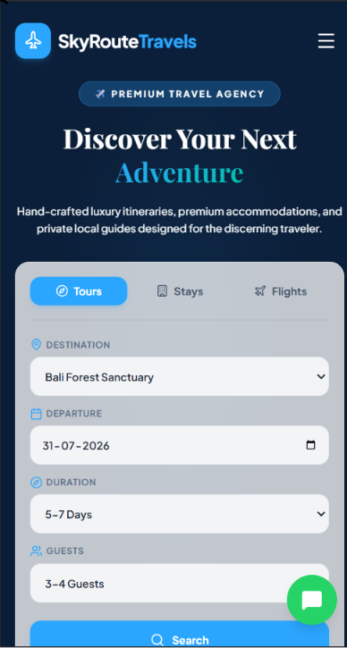

# ✈️ SkyRoute Travels

A premium, fully responsive travel agency website built for tour operators, travel agencies, vacation planners, and luxury travel businesses. Developed with Next.js, TypeScript, Tailwind CSS, and Framer Motion, the website delivers an elegant booking experience with destination showcases, tour packages, travel blogs, contact forms, and a modern responsive UI.

🔗 **Live Demo:** https://skyroute-travels.vercel.app

---

# 📖 About the Project

SkyRoute Travels was created to provide travel businesses with a premium online presence that inspires visitors to explore destinations and book unforgettable journeys.

The website features destination showcases, curated tour packages, travel blogs, interactive galleries, FAQs, and an elegant contact section while maintaining a clean, responsive, and modern user experience.

This project demonstrates modern frontend development using reusable React components, responsive layouts, smooth animations, accessibility, SEO-friendly architecture, and production-ready web development practices.

---

# ✨ Features

### 🌍 Premium Landing Page

- Luxury hero section
- Destination search UI
- Smooth animations
- Modern typography
- Sticky navigation

### ✈️ Popular Destinations

- Featured travel destinations
- Destination highlights
- Beautiful destination cards
- Interactive hover effects

### 🎒 Tour Packages

- Premium package cards
- Pricing information
- Tour duration
- Package details
- Booking buttons

### ⭐ Why Choose Us

- Trusted travel guides
- Best price guarantee
- 24/7 customer support
- Worldwide destinations
- Safe travel experience

### 🖼️ Travel Gallery

- Premium destination gallery
- Masonry layout
- Hover animations
- Responsive image grid

### 📝 Travel Blog

- Travel guides
- Destination tips
- Packing advice
- Vacation inspiration

### 📞 Contact & Booking

- Booking inquiry form
- Google Maps integration
- Contact information
- Office details

### 🎨 User Experience

- Fully responsive design
- Mobile-first development
- Smooth scrolling
- Scroll animations
- Loading animation
- Premium UI/UX

---

# 🛠 Tech Stack

## Frontend

- Next.js
- React
- TypeScript
- Tailwind CSS

## UI & Animations

- Framer Motion
- Lucide React

## Deployment

- Vercel

---

# 📸 Screenshots

## 🏠 Home

<p align="center">
  
</p>

## 🌍 Popular Destinations

<p align="center">
  
</p>

## ✈️ Tour Packages

<p align="center">
  
</p>

## ⭐ Why Choose Us

<p align="center">
  
</p>

## 🖼️ Travel Gallery

<p align="center">
  
</p>

## 📝 Travel Blog

<p align="center">
  
</p>

## ❓ Frequently Asked Questions

<p align="center">
  
</p>

## 📞 Contact & Booking

<p align="center">
  
</p>

## 📱 Mobile Responsive Design

<p align="center">
  
</p>

---

# 📂 Project Structure

```text
skyroute-travels
│
├── public
│   ├── images
│   └── icons
│
├── src
│   ├── app
│   ├── components
│   │   ├── common
│   │   ├── sections
│   │   └── ui
│   ├── hooks
│   └── utils
│
├── screenshots
│
└── README.md
```

---

# ⚙️ Installation

## Clone the repository

```bash
git clone https://github.com/Pulipati-Rahul/skyroute-travels.git
```

## Navigate into the project

```bash
cd skyroute-travels
```

## Install dependencies

```bash
npm install
```

---

# ▶️ Running the Project

```bash
npm run dev
```

Runs on:

```text
http://localhost:3000
```

---

# 🌍 Live Deployment

https://skyroute-travels.vercel.app

---

# 💡 What I Learned

While building this project, I learned:

- Building premium business landing pages
- Modern Next.js architecture
- Responsive UI development
- Framer Motion animations
- Tailwind CSS best practices
- Component-based development
- Mobile-first design
- Reusable UI components
- SEO-friendly layouts
- Deployment using Vercel

---

# 🚀 Future Improvements

- Online tour booking system
- Destination filtering
- Hotel booking integration
- Flight search integration
- Payment gateway
- User accounts
- Wishlist functionality
- Reviews & ratings
- Multi-language support
- CMS integration

---

# 👨‍💻 Author

**Pulipati Rahul**

Full Stack Developer

GitHub:  
https://github.com/Pulipati-Rahul

LinkedIn:  
https://www.linkedin.com/in/pulipatirahul

Portfolio:  
https://pulipatirahul.vercel.app

---

# ⭐ Support

If you found this project helpful, consider giving it a ⭐ on GitHub.

It motivates me to continue building high-quality projects.
